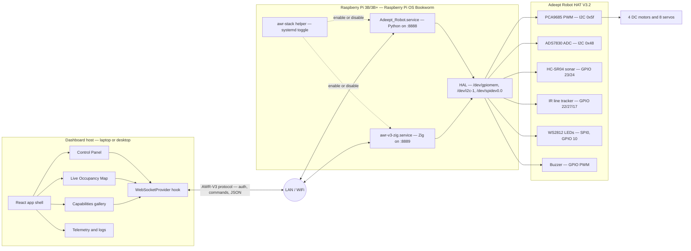
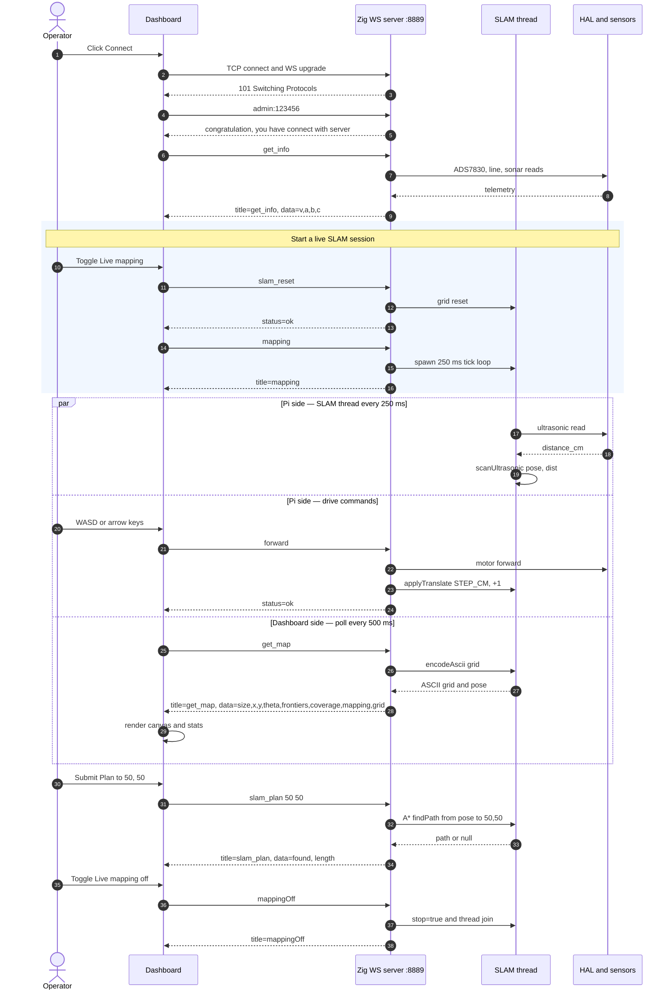

# AWR-V3 Zig Firmware

A high-performance Zig rewrite of the [Adeept AWR-V3](https://www.adeept.com/) robot control firmware, designed to run on Raspberry Pi 3B/3B+/4/5 with the Adeept Robot HAT V3.2.

## Why Zig?

The original AWR-V3 firmware is Python with 15+ pip dependencies, consuming ~200MB RAM with 3-8 second startup. This Zig implementation compiles to a **single ~3MB static binary** using **~1.2MB RAM** at runtime, with sub-50ms startup and true multi-core parallelism (no GIL).

| Metric | Python (Original) | Zig (This Project) |
|--------|-------------------|-------------------|
| Binary size | ~200MB (interpreter + libs) | ~3MB (static) |
| Runtime RSS | ~150-250MB | ~1.2MB |
| Dependencies | 15+ pip + apt packages | Zero |
| Startup | 3-8 seconds | <50ms |
| Thread model | GIL-limited | True 4-core parallelism |

## Features

- **11 compile-time feature toggles** — enable/disable subsystems at build time
- **Dual HAL backends** — simulation (in-memory) and real Linux (**I2C** via `ioctl`, **SPI** via `/dev/spidev*`, GPIO via memory-mapped **`/dev/gpiomem`** on Raspberry Pi targets)
- **4-motor differential drive** — PCA9685 PWM register-level control
- **8-channel servo controller** — pulse-width calculation with clamping and wiggle mode
- **HC-SR04 ultrasonic** — GPIO trigger/echo with explicit timeout handling
- **ADS7830 battery monitor** — raw I2C ADC with voltage divider calculation
- **3-channel IR line tracker** — binary sensor status encoding
- **WS2812 LED driver** — SPI bit-encoded protocol with breath, police, rainbow, and flowing effects
- **Buzzer** — 14-note frequency table with GPIO PWM tone generation
- **PID controller** and **Kalman filter**
- **Live SLAM** — 80x80 Bayesian log-odds occupancy grid fed by the ultrasonic sensor in a background thread, with dead-reckoned pose updated by movement commands and exposed over the WebSocket protocol
- **A\* path planner** — operates on the live occupancy grid, exposed via `slam_plan X Y`
- **WebSocket server** — raw TCP with RFC 6455 framing, mutex-synchronized state, environment-based credentials, supports SLAM streaming (`mapping`, `mappingOff`, `slam_reset`, `get_map`, `slam_plan`)

## Architecture

The whole stack — dashboard host, Pi services, HAT peripherals — at a glance:



Only one of `Adeept_Robot.service` and `awr-v3-zig.service` should be active at a time (they share the I²C/GPIO pins on the HAT). The `awr-stack` helper on the Pi enforces that, and the dashboard ships connection presets for both ports.

## Prerequisites

- [Zig](https://ziglang.org/download/) **0.14.x**. This repo’s `build.zig` targets the Zig 0.14 build API (Zig **0.15+** renamed several `std.Build` options — use **0.14.x** until the project is ported).
- On macOS with Homebrew: `brew install zig@0.14` then put `/opt/homebrew/opt/zig@0.14/bin` first on your `PATH`.
- No other dependencies

## Quick Start

### Build and Run (Simulation Mode)

```bash
# Build with simulation HAL (for development/testing on any platform)
zig build -Dsim=true

# Run the server
AWR_WS_USER=admin AWR_WS_PASS=123456 ./zig-out/bin/awr-v3
```

The server starts on `ws://0.0.0.0:8889` with all subsystems enabled.

### Cross-Compile for Raspberry Pi

```bash
# Build for Pi 3B/3B+/4 (aarch64)
zig build -Dsim=false -Dtarget=aarch64-linux-gnu -Doptimize=ReleaseFast

# Copy to Pi
scp zig-out/bin/awr-v3 pi@<PI_IP>:~/awr-v3

# Run on Pi
ssh pi@<PI_IP>
AWR_WS_USER=admin AWR_WS_PASS=123456 sudo ./awr-v3
```

### Feature Toggles

Every subsystem can be independently enabled/disabled at compile time:

```bash
# Full build (default)
zig build -Dsim=true

# Minimal: motor + servo only
zig build -Dsim=true -Dslam=false -Dcamera=false -Dbuzzer=false -Dled=false -Dbattery=false -Dultrasonic=false -Dline_tracker=false -Dautonomy=false

# SLAM-focused build
zig build -Dsim=true -Dbuzzer=false -Dled=false
```

Available flags: `-Dmotor`, `-Dservo`, `-Dultrasonic`, `-Dline_tracker`, `-Dbattery`, `-Dled`, `-Dbuzzer`, `-Dcamera`, `-Dslam`, `-Dautonomy`, `-Dsim`

Disabled subsystems compile to `void` (zero bytes) and all related code is eliminated.

## Running Tests

```bash
# Run all 38 unit tests
zig build test -Dsim=true
```

Companion **`adeept-dashboard`** provides **Node** WebSocket protocol acceptance tests (`npm run test:protocol`) against `ws-server.mjs`. That harness uses simulator-only HTTP helpers such as **`/capabilities`** and **`/state`** alongside the WebSocket stream. The Zig firmware validates with **`zig build test`**, on-device trials, and connecting the React dashboard to **`ws://<lan-ip>:8889`**.

### Functional acceptance test (no Pi required) — both stacks

`scripts/run-functional-acceptance.sh` builds a Docker image based on the official **Raspberry Pi OS Bookworm** (`dtcooper/raspberrypi-os:bookworm`, `linux/arm64`) and runs a full black-box test of **both** the Zig firmware and the vendor Python firmware, end-to-end, on the same userspace, including a phase that brings both up live and toggles between them via `awr-stack`.

From the parent of this repo:

```bash
# Optional: point at the vendor V3 source. Auto-detected if it lives at
# ~/Downloads/Adeept_AWR-V3-*/Code/Adeept_AWR-V3 or ../Adeept_AWR-V3.
export VENDOR_SRC=/path/to/Adeept_AWR-V3
bash zig-awr-v3/scripts/run-functional-acceptance.sh
```

The orchestrator (`scripts/acceptance/run-in-container.sh`) runs 13 phases and emits **PASS / FAIL** per assertion plus a final summary (currently **88 / 88 PASS**, ~100 s on Apple Silicon):

| Phase | Stack | What it proves |
|---|---|---|
| **A** | both | Pi OS Bookworm userspace, Node 22, Python 3.11, `systemctl` stub, repos mounted |
| **B** | Zig | `install-pi.sh --dry-run` announces every step (deps, Zig, stage, creds, unit, helper, daemon-reload) |
| **C** | Zig | `install-pi.sh --build-mode sim` produces the `awr-v3` binary, `chmod 600` `credentials.env`, systemd unit with the correct `ExecStart` / `EnvironmentFile` / `WantedBy`, the `awr-stack` helper, calls `daemon-reload`, **and leaves the unit disabled** (no auto-start war with vendor Python) |
| **D** | Zig | Compiled Zig binary listens on `:8889` and passes the full SLAM acceptance test (auth → `get_info` → `slam_reset` → `mapping` → 6× `forward` advancing pose → `get_map` shows `mapping=true` → `slam_plan X Y` → 4× `rotate-left` changes `theta` → `mappingOff` clears flag → `DS` / `TS` ack) plus 16 movement / switch / function / servo / JSON-payload commands shared with the vendor |
| **E** | Zig | `awr-stack {zig,python,stop,status}` issues exactly the right `systemctl` calls (recorded by the stub) |
| **F** | Dashboard | The dashboard's `npm run test:protocol` suite (incl. SLAM acceptance) passes against the Node simulator |
| **G** | Zig+Dashboard | The generic `ws-protocol-test.mjs` passes against the **Zig binary** — cross-implementation parity Zig ⇆ Node |
| **H** | Zig | `uninstall-pi.sh` removes prefix, unit, credentials and stops the service |
| **I** | Vendor | The original `Adeept_AWR-V3/setup.py` runs (apt + pip pre-baked, reboot stripped) and lands `Adeept_Robot.service`, `wifi-hotspot-manager.service`, and `~/startup.sh`; daemon-reload and enable are issued; **the Zig service unit is left intact** (additive, no clobber) |
| **J** | Vendor | The vendor `WebServer.py` actually boots inside the container (with hardware stubs) on `:8888` and passes the common-protocol acceptance test (movement, switches, functions, servos, telemetry, JSON payloads) |
| **K** | Both | **Live dual-stack**: vendor Python on `:8888` and Zig binary on `:8889` run *concurrently*, and the protocol test passes against both backends simultaneously |
| **L** | Both | With both stacks installed, `awr-stack zig`, `awr-stack python`, `awr-stack both`, and `awr-stack stop` all produce the correct `systemctl` dispatch |
| **M** | Both | Zig uninstall + vendor cleanup leaves no service files, no startup.sh, no prefix — full clean teardown |

Mechanics worth knowing about:

- The acceptance container uses a stubbed `/usr/local/bin/systemctl` (`docker/stub-systemctl`) that records every invocation to `/var/log/stub-systemctl.log`, so we can assert the install-pi.sh / vendor `setup.py` / `awr-stack` control-plane behaviour without booting a real init system.
- The Zig binary is built with `-Dsim=true` so its HAL doesn't try to open `/dev/gpiomem` or `/dev/i2c-1`, but the network protocol, SLAM dispatch, occupancy-grid logic, pose integration, and path planner are the same code paths as on the Pi.
- The vendor Python is run with hardware-touching modules (`Move`, `RPIservo`, `Functions`, `RobotLight`, `Switch`, `Voltage`, `app`, `camera_opencv`, plus the Adafruit / `board` / `busio` libraries) replaced by no-op stubs in `docker/vendor_stubs/`. The **real** `WebServer.py` protocol code (auth, `recv_msg`, `robotCtrl`, `switchCtrl`, `functionSelect`, `configPWM`, `get_info`, JSON `findColorSet`) runs unchanged.
- Phases F + G skip themselves if `adeept-dashboard` is absent. Phases I–M skip themselves if no vendor V3 source is found (or `VENDOR_SRC` is unset and no auto-detect target exists).

## Project Structure

```
zig-awr-v3/
├── build.zig                          # Build system with feature toggles
├── src/
│   ├── main.zig                       # Entry point, RobotState struct
│   ├── hal.zig                        # Hardware abstraction (Sim + Linux backends)
│   ├── motor/driver.zig               # 4-motor differential drive via PCA9685
│   ├── servo/controller.zig           # 8-ch servo with pulse-width calc
│   ├── sensor/
│   │   ├── ultrasonic.zig             # HC-SR04 with timeout handling
│   │   ├── battery.zig                # ADS7830 ADC battery monitor
│   │   └── line_tracker.zig           # 3-channel IR binary reader
│   ├── led/ws2812.zig                 # WS2812 SPI driver + 4 effect modes
│   ├── audio/buzzer.zig               # 14-note frequency table + GPIO PWM
│   ├── control/
│   │   ├── pid.zig                    # PID controller
│   │   └── kalman.zig                 # Kalman filter
│   ├── slam/
│   │   ├── occupancy_grid.zig         # 80x80 Bayesian log-odds grid
│   │   └── path_planner.zig           # A* pathfinding
│   └── net/
│       ├── ws_server.zig              # WebSocket server (raw TCP + RFC 6455) + live SLAM dispatch
│       └── protocol.zig               # Command parser + JSON response builder
├── scripts/
│   ├── install-pi.sh                  # One-shot Pi installer (Zig + service + helper)
│   ├── uninstall-pi.sh                # Removes the Zig stack only (vendor stack untouched)
│   ├── awr-stack                      # Toggle helper for vendor Python vs Zig services
│   ├── run-functional-acceptance.sh   # Build + run the dual-stack Docker acceptance run
│   └── acceptance/
│       ├── run-in-container.sh        # 13-phase black-box orchestrator (in-container)
│       ├── ws-protocol-test.mjs       # Generic WS test (works vs Zig, Node simulator, vendor Python)
│       ├── run-vendor-setup.sh        # Wraps vendor setup.py to be Docker-safe (no reboot, no purges)
│       └── run-vendor-server.sh       # Boots vendor WebServer.py with hardware stubs
└── docker/
    ├── Dockerfile.acceptance          # Pi OS Bookworm + Node 22 + Python 3.11 + stubbed systemctl
    ├── stub-systemctl                 # Records every systemctl call for assertions
    └── vendor_stubs/                  # No-op replacements for the vendor's hardware-touching imports
        ├── Move.py / RPIservo.py / Functions.py / RobotLight.py / Switch.py / Voltage.py
        ├── Info.py / app.py / camera_opencv.py
        └── board.py / busio.py / adafruit_pca9685.py / adafruit_motor/{__init__,motor,servo}.py
```

## WebSocket Protocol

Compatible with the original Adeept AWR-V3 Python server protocol. Authentication uses environment variables:

```bash
export AWR_WS_USER=admin
export AWR_WS_PASS=123456
```

All commands from the original protocol are supported: movement, camera tilt, speed, function toggles, switch control, servo calibration, JSON payloads, and `get_info` telemetry.

### Live SLAM commands

The Zig firmware adds a small SLAM extension on top of the vendor protocol:

| Command | Effect | Response shape |
|---|---|---|
| `mapping` | Spawn the background mapping thread (250 ms ultrasonic ticks). | `{title:"mapping"}` |
| `mappingOff` | Stop the mapping thread. | `{title:"mappingOff"}` |
| `slam_reset` | Clear the grid and reset pose to the centre. | `{title:"slam_reset"}` |
| `get_map` | Return current pose, frontiers, coverage, and an ASCII grid (`?` unknown, `.` free, `#` occupied). | `{title:"get_map", data:{size, cell_cm, x, y, theta, frontiers, coverage, mapping, grid}}` |
| `slam_plan X Y` | Run A\* from current pose to `(X,Y)` cell, returning path length. | `{title:"slam_plan", data:{found, length}}` |

Pose is dead-reckoned: `forward`/`backward` advance the pose by `STEP_CM_PER_MOVE` cm along the heading, and `rotate-*` adjust the heading by ~15°. Without wheel encoders the map will drift over long runs, but it is sufficient for a live demo and frontier visualisation.

### Protocol sequence — full live SLAM session

The exchange a dashboard performs against this firmware (or the Node simulator) when the operator opens **Live Occupancy Map** and drives the robot:



The same exchange is what the black-box `scripts/acceptance/ws-protocol-test.mjs` asserts on, so any deviation in either direction (Zig binary or Node simulator) breaks the acceptance suite.

## One-shot Pi installer

`scripts/install-pi.sh` is the equivalent of the vendor `setup.py` for this stack. It installs Zig 0.14.x, builds the binary, and registers a systemd unit (DISABLED by default so it does not fight the vendor service):

```bash
git clone https://github.com/danielzurawski/zig-awr-v3.git
cd zig-awr-v3
sudo bash scripts/install-pi.sh         # full install, leaves Adeept_Robot.service alone
sudo bash scripts/install-pi.sh --dry-run   # print every step without running it
```

Once installed, the `awr-stack` helper toggles between the vendor Python firmware and this Zig firmware:

```bash
awr-stack status     # show enable/active state for both services
awr-stack zig        # stop+disable Adeept_Robot.service, enable+start awr-v3-zig.service
awr-stack python     # the inverse: switch back to the vendor stack
awr-stack stop       # stop both for manual scripting / examples
```

Both services share the same I2C/GPIO peripherals on real hardware, so only one should run at a time. The dashboard already includes presets for `ws://raspberry-pi.local:8888` (Python) and `ws://raspberry-pi.local:8889` (Zig) — switch the active stack on the Pi, then re-connect from the dashboard.

To uninstall the Zig stack (without touching the vendor stack): `sudo bash scripts/uninstall-pi.sh`.

## Hardware

Designed for the Adeept Robot HAT V3.2:

| Device | Interface | Address | Zig Module |
|--------|-----------|---------|------------|
| PCA9685 (PWM) | I2C | 0x5f | `hal.zig` → `motor/driver.zig`, `servo/controller.zig` |
| ADS7830 (ADC) | I2C | 0x48 | `hal.zig` → `sensor/battery.zig` |
| HC-SR04 | GPIO 23/24 | — | `sensor/ultrasonic.zig` |
| Line Tracker | GPIO 22/27/17 | — | `sensor/line_tracker.zig` |
| WS2812 LEDs | SPI0 (GPIO 10) | — | `led/ws2812.zig` |
| Buzzer | GPIO 18 | — | `audio/buzzer.zig` |
| LEDs 1-3 | GPIO 9/25/11 | — | `hal.zig` (direct GPIO) |

## License

Apache License 2.0 — see [LICENSE](LICENSE) for details.